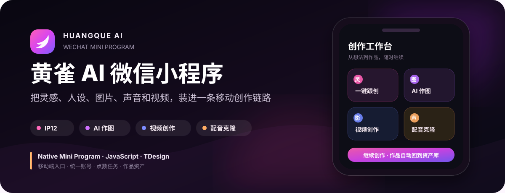

<p align="center">
  
</p>

<h1 align="center">黄雀 AI 微信小程序</h1>

<p align="center">
  把灵感、人设、图片、声音和视频，组织成一条可在微信内持续完成的 AI 创作链路。
</p>

<p align="center">
  <code>微信原生小程序</code> · <code>JavaScript</code> · <code>TDesign</code> · <code>Node Tests</code>
</p>

## 这是什么

这是黄雀 AI 的微信小程序前端。它复用黄雀已有的账号、点数、任务和作品资产体系，让用户从微信进入灵感跟创、IP 人设、图片、配音、声音克隆和视频创作，并在历史作品中继续查看与管理结果。

本仓库只保存小程序客户端与相关契约测试；生成模型、计费、任务队列和文件服务由黄雀后端提供。

## 核心能力

| 能力 | 用户可以做什么 | 代码入口 |
|---|---|---|
| 🐤 IP12 人设教练 | 梳理数字化 IP 方向、保存阶段结果并查看确认后的报告/PDF | `miniprogram/pages/ip12/` |
| ✨ 灵感跟创 | 浏览创作灵感，把案例带入自己的营销内容 | `miniprogram/pages/inspiration/` |
| 🎨 AI 作图 | 使用模板、提示词、草稿和多张参考图生成视觉内容 | `miniprogram/pages/banana/` |
| 🎬 视频创作 | 完成电影化身、AI 视频生成与数字人口播等创作流程 | `miniprogram/pages/video/` |
| 🎙️ 配音与声音克隆 | 选择公共或个人音色生成配音，并在单独授权后创建专属声音 | `miniprogram/pages/audio/` · `miniprogram/pages/clone/` |
| 🗂️ 作品资产 | 查看图片、音频和视频历史，继续预览、保存或复用提示词 | `miniprogram/pages/assets/` |
| 👤 账户与权益 | 查看会员、点数、邀请关系、充值入口和协议说明 | `miniprogram/pages/profile/` · `miniprogram/pages/invite/` |

## 产品闭环

```text
发现灵感 / IP12 定位
        ↓
生成提示词、文案与创作计划
        ↓
AI 作图 / 配音 / 视频 / 数字人口播
        ↓
任务状态、失败退点与结果回传
        ↓
历史作品与个人资产继续复用
```

## 技术结构

```text
微信小程序原生页面
  ├─ app.js / app.json / app.wxss
  ├─ pages/        业务页面与交互
  ├─ utils/api.js  登录态、请求与文件访问封装
  └─ assets/       首页、图标、分享与导航素材
          │
          ▼
黄雀后端能力层
  ├─ 账号与授权
  ├─ 点数与会员
  ├─ 图片 / 音频 / 视频任务
  └─ 作品与数字化 IP 资产
```

## 仓库结构

```text
huangque-miniprogram/
├── miniprogram/
│   ├── pages/              # 首页、IP12、作图、视频、音频、资产等页面
│   ├── utils/              # API、草稿、IP12 与授权辅助逻辑
│   ├── assets/             # 小程序使用的图片和图标
│   ├── app.js              # 全局状态与服务入口
│   ├── app.json            # 页面、窗口与 tabBar 配置
│   └── app.wxss            # 全局视觉样式
├── tests/                  # Node 契约与静态回归测试
├── project.config.json     # 微信开发者工具项目配置
└── 使用说明-如何运行和发布.md
```

## 本地运行

### 1. 安装依赖

```bash
cd miniprogram
npm install
```

### 2. 导入微信开发者工具

在微信开发者工具中选择“导入项目”，目录指向仓库根目录（包含 `project.config.json` 的目录）。使用具备该小程序开发权限的账号和 AppID，并在本地私有配置中维护个人开发设置。

如需使用 npm 依赖，在开发者工具中执行“工具 → 构建 npm”，然后编译或真机预览。

### 3. 运行回归测试

```bash
node --test tests/*.test.js
```

测试覆盖账号与授权、会员支付、邀请、IP12、图片草稿与多参考图、视频渠道、数字人形象和任务防重复提交等关键客户端契约。

## 发布状态要分清

```text
代码完成 → PR/CI → 合并 main → 开发者工具上传
        → 微信审核 → 正式发布 → 用户真实可用
```

GitHub `main` 的代码、开发版上传、微信审核和正式发布是不同状态。README 不以某次动态版本号宣称当前正式版；发布前应在微信公众平台和真机上重新核验。

## 安全与合规

- 不在仓库提交密码、Token、Cookie、私钥、数据库、用户数据或本机私有配置。
- 相册、相机、麦克风和声音信息只在用户主动使用对应功能时申请或处理。
- 声音克隆和数字人口播需要独立授权；拒绝不影响其他功能。
- AI 生成结果需要保留适用标识，并在对外使用前由用户自行核验。
- 涉及支付、点数、会员、邀请奖励和用户数据的改动必须通过专项测试与真实业务验收。

## 开发约定

1. 从最新 `main` 创建独立分支或 worktree。
2. 只修改当前任务所需文件，保留他人的未提交工作。
3. 先运行相关专项测试，再运行完整 `node --test tests/*.test.js`。
4. 通过 PR 与检查进入 `main`；合并不等于微信正式发布。
5. 上传、提审、发布、真实支付或生产操作需要单独授权与验收。

---

<p align="center">
  <strong>黄雀 AI</strong> · 让移动创作从一次生成，变成可继续积累的数字资产。
</p>
